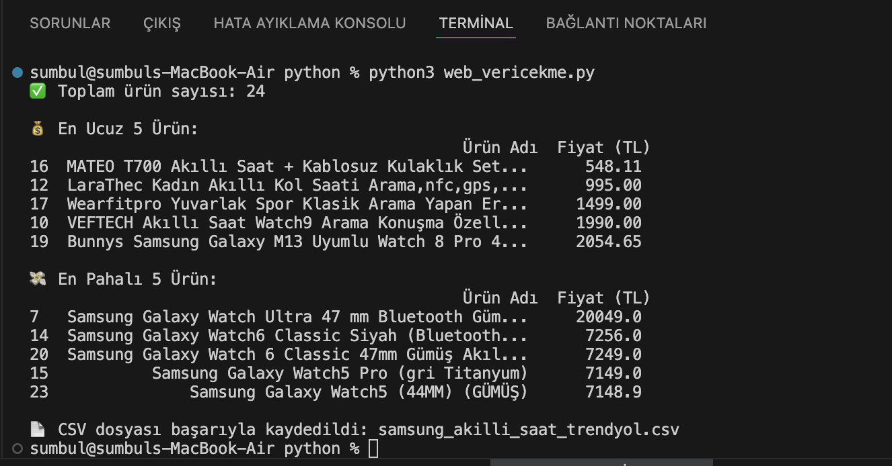

📊 Web Tabanlı Veri Toplama ve Fiyat Karşılaştırma Aracı
Bu proje, DFA Teknoloji 2025 Yaz Stajı Teknik Seçim Görevi kapsamında gerçekleştirilmiştir.
Amaç, Trendyol üzerinden belirli bir ürün için farklı satıcıların sunduğu fiyatları toplamak ve karşılaştırmalı analiz etmektir.

🔍 Görev Tanımı
Belirli bir ürün araması yapılır (örneğin: "Samsung Akıllı Saat")
Trendyol üzerinden ürün adı ve fiyat bilgisi çekilir

Veriler analiz edilerek:
En ucuz 5 ürün
En pahalı 5 ürün listelenir
Veriler .csv formatında dışa aktarılır

🛠️ Kullanılan Teknolojiler:
Python 3.12
Selenium (web sayfasını açmak ve HTML almak için)
Regex (re modülü, gömülü JSON'dan veri ayıklamak için)
pandas (veri analizi ve dosya işlemleri)
Brave (Chromium tabanlı tarayıcı, Selenium ile otomasyon)

📁 Proje Dosyaları
Dosya Adı	Açıklama
web_vericekme.py	Veri çekme ve analiz kodu (Python)
samsung_akilli_saat_trendyol.csv	Elde edilen ürün verileri
sayfa_kaynagi.html	Sayfa içeriği (debug amaçlı alınmıştır)
Staj_Teknik_Rapor.pdf	Teknik açıklamaları içeren proje raporu

🚀 Nasıl Çalıştırılır?
Gerekli paketleri kur:
nginx
Kopyala
Düzenle
pip install selenium pandas
web_vericekme.py dosyasındaki chrome_driver_path alanını kendi cihazına göre güncelle.

Komutu çalıştır:
nginx
Kopyala
Düzenle
python3 web_vericekme.py

🖼️ Terminal Görüntüsü

Veri çekimi sonrası elde edilen terminal çıktısı:

📌 Notlar
Trendyol sayfasında HTML class adları dinamik olduğu için klasik scraping yerine gömülü JSON'dan veri çekilmiştir.

Brave kullanıldığı için Options.binary_location parametresi kodda yer almaktadır.

✍️ Yazan
Sümbül BİNGÖL
DFA Teknoloji Staj Adayı – Mayıs 2025